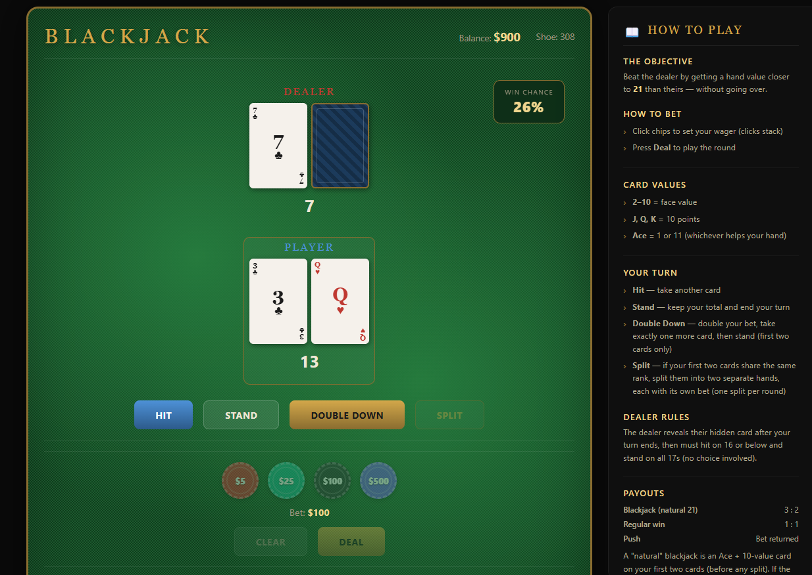
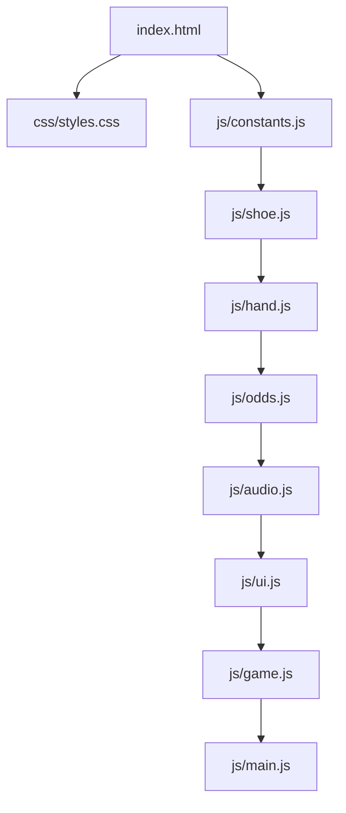
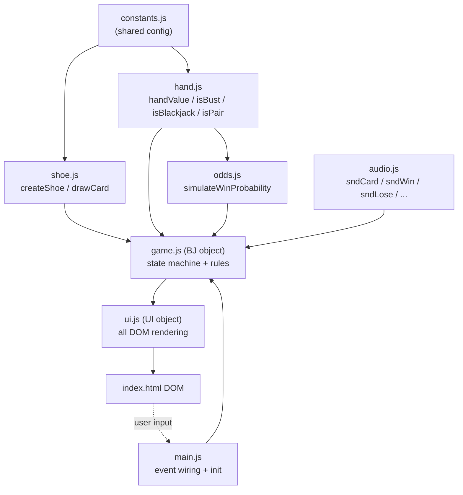

# Blackjack

Simple Blackjack game using HTML, CSS, and JavaScript. Includes an Odds calculator before you hit or stand.
Built to closely match the look, feel, and animation timing of the `baccarat-reference/` example.

## Files

| File | Purpose |
|---|---|
| `index.html` | Page markup only — table, betting area, player action row, scoreboard, rules panel, and overlays. Loads `css/styles.css` and the `js/` scripts in dependency order. |
| `css/styles.css` | All visual styling: felt table, card flip/deal animations, chips, result banner, odds badge, hand-zone highlighting, history table, rules panel, and responsive/mobile rules. |
| `js/constants.js` | Shared constants with no dependencies — suits, ranks, card values, shoe size (6 decks), reshuffle cut-card threshold, starting bankroll, min bet, blackjack payout, split cap, Monte Carlo trial count. |
| `js/shoe.js` | Builds and shuffles the 6-deck shoe (`createShoe`, `shuffleShoe`) and draws cards from it (`drawCard`). |
| `js/hand.js` | Pure hand-value math: soft/hard Ace totals (`handValue`), bust check (`isBust`), natural-blackjack check (`isBlackjack`), pair check for splitting (`isPair`). |
| `js/odds.js` | Monte Carlo win-probability estimator (`simulateWinProbability`) for the corner "Win Chance" badge — simulates the dealer's remaining draws from the real unseen card pool thousands of times per call. |
| `js/audio.js` | Tiny Web Audio synth (no audio files) for card/chip/win/lose/push/bust sounds. |
| `js/ui.js` | The `UI` object — every DOM read/write lives here: rendering cards and hand-zones, updating bankroll/shoe/bet displays, the history table, stats row, odds badge, toasts, and the result banner. No game rules or state live in this file. |
| `js/game.js` | The `BJ` object — the game's state machine and all blackjack rules: dealing, naturals, hit/stand/double/split, dealer play (stand on all 17s), payouts, bankroll/stats/history bookkeeping, reshuffle and bankrupt handling. Calls into `UI` to render and into `hand.js`/`shoe.js`/`odds.js` for logic. |
| `js/main.js` | Wires DOM events (chips, action buttons, keyboard shortcuts, rules panel toggle) to `BJ` methods, and calls `BJ.init()` on load. The only file that touches `addEventListener` directly. |
| `Specification.md` | The original project requirements. |
| `Plan.md` | The implementation plan derived from the specification and the baccarat reference. |
| `baccarat-reference/` | Reference-only baccarat example (`baccarat.html`, `baccarat-image.png`) used as the visual/animation template — not part of the running app. |

## Architecture

All `js/` files are loaded as classic `<script>` tags (not ES modules) so the
game runs by simply opening `index.html` — no build step or local server
required. Each file attaches to the shared global scope in dependency order.

### File load order & dependencies

### Runtime relationships

`game.js` is the only file that mutates game state; it calls into `shoe.js`,
`hand.js`, and `odds.js` for pure logic, and into `ui.js` to reflect that state
back onto the page. `ui.js` never reaches back into `game.js` — it only reads
the data it's given. `main.js` is the sole entry point for DOM events and the
only file that calls `BJ.init()`.
