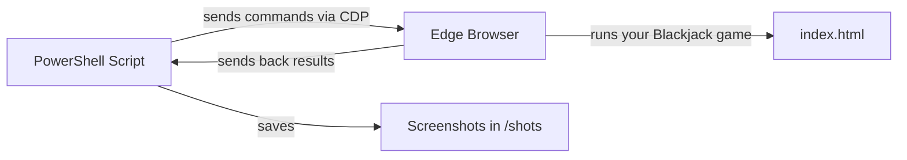
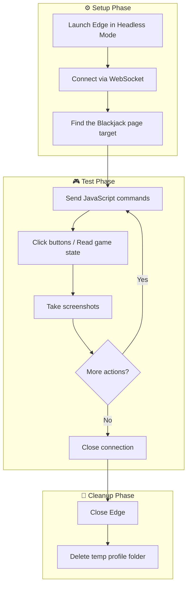
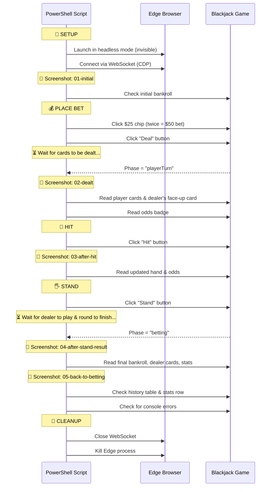
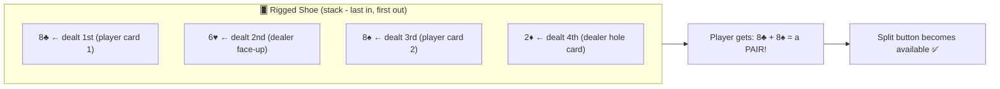
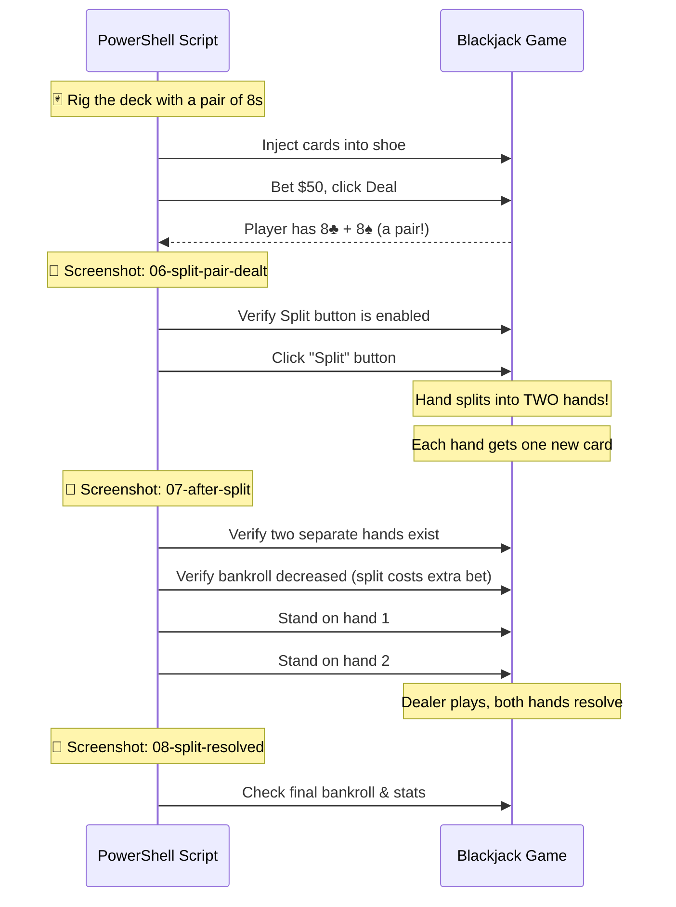
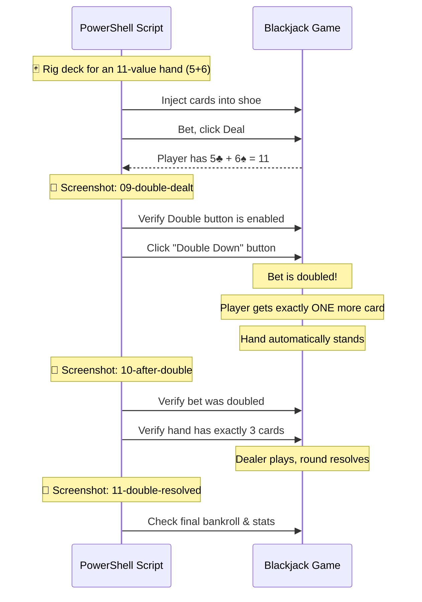
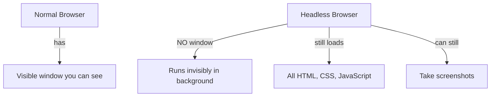
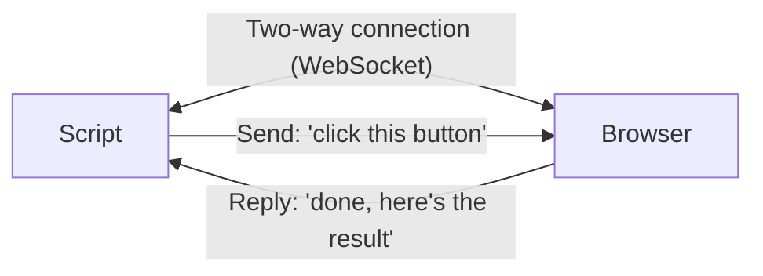
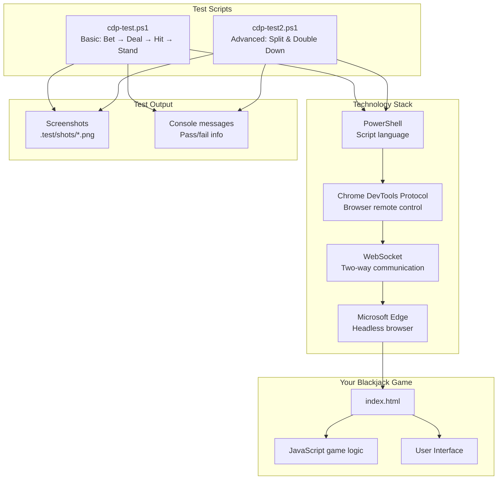

# 🧪 Understanding the `.test` Folder

> **For new developers:** This guide explains what the test scripts do, why they exist, and how they work — step by step with diagrams!

---

## 📁 What's In This Folder?

```
.test/
├── cdp-test.ps1      ← Test script #1: Basic gameplay (Bet → Deal → Hit → Stand)
├── cdp-test2.ps1     ← Test script #2: Advanced gameplay (Split & Double Down)
└── shots/            ← Screenshots taken during tests (visual proof it works!)
    ├── 01-initial.png
    ├── 02-dealt.png
    ├── 03-after-hit.png
    ├── ...and more
```

---

## 🤔 What Is a "Test" and Why Do We Need One?

A **test** is code that plays your game automatically to make sure it works correctly. Instead of you manually clicking buttons every time you change something, the test does it for you!

Think of it like a robot that:
1. Opens your game in a browser
2. Clicks buttons (bet, deal, hit, stand)
3. Checks that the game responds correctly
4. Takes screenshots as proof

---

## 🔧 What Is "CDP"?

CDP stands for **Chrome DevTools Protocol**. It's a way for code to **remote-control** a web browser. The test scripts use it to control Microsoft Edge like a puppet!



---

## 🏗️ How the Test Infrastructure Works



---

## 📝 Test Script #1: `cdp-test.ps1` — Basic Gameplay

This script tests a normal round of Blackjack: betting, dealing, hitting, and standing.

### Step-by-Step Flow



### What It Checks

| Step | What It Verifies |
|------|-----------------|
| Initial state | Game loads with correct bankroll |
| Bet & Deal | Clicking chips and Deal button works |
| Player Turn | Cards are dealt, phase changes correctly |
| Hit | Player receives a card, odds update |
| Stand | Dealer plays, round resolves, bankroll updates |
| History | Results are recorded in the history table |
| Errors | No JavaScript errors occurred |

---

## 📝 Test Script #2: `cdp-test2.ps1` — Split & Double Down

This script tests **advanced moves** that are harder to test manually because you need specific card combinations.

### 🃏 The "Rigged Deck" Trick

To test a Split, you need two cards of the same rank. To test Double Down, you need a hand totaling 11. The script **rigs the shoe** (deck) by pushing specific cards onto the top:



### Split Test Flow



### Double Down Test Flow



---

## 🖥️ Key Concepts Explained

### Headless Browser



The `--headless=new` flag tells Edge to run without showing a window. The game still loads and works — you just can't see it! The test takes screenshots so you can see what happened.

### WebSocket Connection



A WebSocket is like a phone call between the script and the browser — both sides can talk at any time. This is how the script sends commands and gets responses.

### The `Send-CDP` Function

This is the heart of the test. It:
1. Packages a command as JSON
2. Sends it to Edge via WebSocket
3. Waits for and returns the response

### The `Eval` Function

A shortcut that runs JavaScript inside the browser page. For example:
- `Eval "document.getElementById('btnHit').click()"` → clicks the Hit button
- `Eval "BJ.getState().phase"` → reads what phase the game is in

### The `Screenshot` Function

Takes a picture of the browser page and saves it as a PNG file in the `shots/` folder.

---

## 📸 Screenshots Produced

The `shots/` folder contains visual evidence from each test run:

| Screenshot | What It Shows |
|-----------|---------------|
| `01-initial.png` | Game loaded, ready to bet |
| `02-dealt.png` | Cards dealt, player's turn |
| `03-after-hit.png` | After player hits |
| `04-after-stand-result.png` | Round result after standing |
| `05-back-to-betting.png` | Back to betting phase |
| `06-split-pair-dealt.png` | Pair of 8s dealt (ready to split) |
| `07-after-split.png` | After splitting into two hands |
| `08-split-resolved.png` | Split round finished |
| `09-double-dealt.png` | Hand of 11 dealt (ready to double) |
| `10-after-double.png` | After doubling down |
| `11-double-resolved.png` | Double down round finished |

---

## 🔄 Overall Test Architecture



---

## 💡 Summary for New Developers

| Question | Answer |
|----------|--------|
| **What language are the tests in?** | PowerShell (`.ps1` files) — a scripting language built into Windows |
| **Why not just test manually?** | Tests can run automatically every time you change code, catching bugs instantly |
| **What does "headless" mean?** | The browser runs without a visible window (like a background process) |
| **What is CDP?** | Chrome DevTools Protocol — lets code control a browser remotely |
| **Why rig the deck?** | To test specific scenarios (like splits) that would be random otherwise |
| **What are the screenshots for?** | Visual proof that the game looked correct at each step |
| **Do I need to run these?** | They've already been run! The screenshots in `shots/` are the results |

---

## 🚀 How to Run the Tests Yourself

1. Open **PowerShell** on Windows
2. Navigate to your project folder: `cd C:\Users\chris\GitHub_Projects\Blackjack`
3. Run: `.\.test\cdp-test.ps1` (basic test)
4. Run: `.\.test\cdp-test2.ps1` (advanced test)
5. Check the `.test\shots\` folder for new screenshots!

> ⚠️ **Note:** You need Microsoft Edge installed, and the file paths in the scripts need to match your computer's setup.
