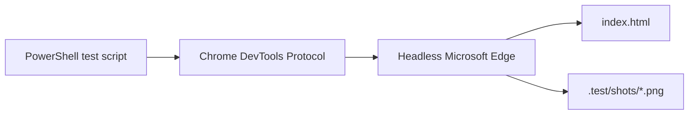

# Test Plan

This document covers the browser automation checks in `.test/`. The tests exercise the main Blackjack flows through the actual UI, capture screenshots for review, and inspect runtime state through the public `BJ.getState()` hook.

## Scope

The current test pass focuses on high-value gameplay paths:

- Page load and initial betting state
- Chip betting and Deal flow
- Hit and Stand during a normal hand
- Dealer resolution and return to betting
- Odds badge updates after cards are dealt
- History table and stats row updates
- Split eligibility, split execution, and split-hand resolution
- Double Down eligibility, single-card draw, doubled bet, and resolution
- Basic console-error check

These are end-to-end smoke tests, not a full rules-engine test suite. They verify that the major UI flows work together in the browser.

## Test Files

```
.test/
├── cdp-test.ps1      # Basic round: bet, deal, hit, stand, resolve
├── cdp-test2.ps1     # Deterministic split and double-down scenarios
└── shots/            # Screenshots produced by the scripts
```

## Harness

The scripts launch Microsoft Edge in headless mode and connect to it through the Chrome DevTools Protocol. CDP lets PowerShell evaluate JavaScript in the loaded page, click DOM controls, read game state, and capture screenshots.



Each script creates a temporary Edge profile, opens the local `index.html` file, connects over a WebSocket debugger endpoint, runs the scenario, saves screenshots, then closes Edge and removes the temporary profile.

## `cdp-test.ps1`: Basic Gameplay

This script validates a normal round from the betting screen through final resolution.

Flow:

1. Open the game and capture the initial state.
2. Place a `$50` bet using two `$25` chip clicks.
3. Deal the hand and wait for `phase === "playerTurn"`.
4. Capture dealt cards and verify the odds badge has rendered.
5. Hit once when available.
6. Capture the updated player hand and odds value.
7. Stand when available.
8. Wait for the dealer to finish and the game to return to betting.
9. Capture final bankroll, dealer cards, stats, history, and visible scoreboard cells.
10. Check the page error hook for JavaScript errors.

Expected evidence:

| Screenshot | Purpose |
|---|---|
| `01-initial.png` | Game loaded and ready for betting |
| `02-dealt.png` | Initial cards dealt and player turn active |
| `03-after-hit.png` | Player hand after a hit |
| `04-after-stand-result.png` | Dealer resolution after standing |
| `05-back-to-betting.png` | Betting state restored with history/stats updated |

## `cdp-test2.ps1`: Split and Double Down

This script covers actions that require specific starting cards. It replaces the shoe with a controlled shoe immediately before each scenario, then drives the UI normally.

### Split Scenario

The script rigs a pair of 8s so the Split button should be available after the deal.

Flow:

1. Inject a shoe that deals player `8,8` with a dealer up-card.
2. Place a `$50` bet and deal.
3. Verify the Split button is enabled.
4. Click Split.
5. Confirm two player hands exist, each with its own bet.
6. Stand both hands.
7. Wait for resolution and capture bankroll, stats, and history.

Expected evidence:

| Screenshot | Purpose |
|---|---|
| `06-split-pair-dealt.png` | Pair dealt and Split available |
| `07-after-split.png` | Two player hands rendered after splitting |
| `08-split-resolved.png` | Split round resolved and recorded |

### Double Down Scenario

The script rigs an 11-value player hand so Double Down should be available after the deal.

Flow:

1. Inject a shoe that deals player `5,6`.
2. Deal the hand.
3. Verify the Double Down button is enabled.
4. Click Double Down.
5. Confirm the bet is doubled, exactly one card is drawn, and the hand is no longer active.
6. Wait for resolution and capture bankroll, stats, and history.

Expected evidence:

| Screenshot | Purpose |
|---|---|
| `09-double-dealt.png` | 11-value hand dealt and Double Down available |
| `10-after-double.png` | Bet doubled and one card drawn |
| `11-double-resolved.png` | Double-down round resolved and recorded |

## Validation Points

The scripts check both DOM-level behavior and game-state behavior:

| Area | What is validated |
|---|---|
| Browser load | `index.html` opens through Edge and exposes `BJ.getState()` |
| Betting | Chip clicks update the bet and Deal starts the round |
| State machine | Phases advance through betting, player turn, dealer turn, and result |
| Actions | Hit, Stand, Split, and Double Down are enabled only when expected |
| Rendering | Cards, hand labels, odds badge, history, and stats are visible in screenshots |
| Bankroll | Bets are deducted and payouts return the game to a consistent bankroll |
| Determinism | Rigged shoes make Split and Double Down scenarios repeatable |
| Errors | The basic test reports any captured JavaScript errors |

## Running the Tests

From the project root in PowerShell:

```powershell
.\.test\cdp-test.ps1
.\.test\cdp-test2.ps1
```

Requirements:

- Windows with Microsoft Edge installed at the path used by the scripts
- The project checked out at `C:\Users\chris\GitHub_Projects\Blackjack`, unless the script paths are updated
- PowerShell execution policy that allows local scripts to run

Screenshots are written to:

```text
.test\shots\
```

## Current Limitations

The CDP tests are useful smoke coverage, but they are not exhaustive. Areas that would benefit from additional targeted tests include:

- Natural blackjack payout and dealer/player simultaneous blackjack
- Bust handling for player and dealer
- Push outcomes
- Bankrupt overlay
- Reshuffle threshold behavior
- Keyboard shortcuts
- Odds-calculation sanity checks for known hand situations
- Unit tests for pure logic in `hand.js`, `shoe.js`, and `odds.js`
